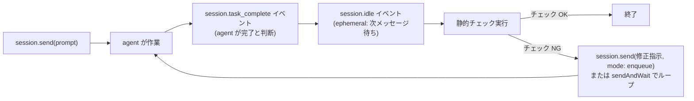

# DeepWiki Q&A with Code Context for Repository: github/copilot-sdk
## Q1
agent が stop するのに hook して、静的チェックをし、失敗したら stop を block して修正継続を促すことって、 CLI だとできるはずなのだけれど、 SDK でもできるはずだよね？どうやってやるの?
### Answer
## SDK での「agent stop をブロックして静的チェック → 修正継続」の実現方法

CLIでは stop hook が同期的にブロックできますが、**SDK では同等のことを「イベント購読 + 新メッセージのキューイング」の組み合わせで実現します**。

---

### 仕組みの全体像



---

### 使うべき2つの仕組み

#### ① `session.task_complete` / `session.idle` イベント = agent の「stop」検知

`session.task_complete` は「agent がタスクを完了したと判断した」時点で発火します。 copilot-sdk:461-467 

`session.idle` は「すべての処理が終わり、次のメッセージを待てる状態」になったことを示す ephemeral イベントです。これが CLI の stop hook の相当物です。 copilot-sdk:388-393 

#### ② `session.send({ mode: "enqueue" })` = stop のブロックと修正継続の注入

チェックが失敗したら `mode: "enqueue"` でメッセージを送ることで、agent の次ターンに修正タスクを割り込ませます。idle になったタイミングで enqueue されたメッセージがあれば、そのまま新しいターンとして処理されます。 copilot-sdk:390-397 

---

### 実装パターン：`sendAndWait` ループ（推奨）

最もシンプルなパターンは `sendAndWait()` を使ったループです。`sendAndWait` は内部で `session.idle` を待機します。 copilot-sdk:205-258 

具体的には:

1. `session.sendAndWait(options)` で agent の1ターン完了まで待つ
2. ターン完了後に静的チェックを実行
3. エラーがあれば `session.send({ prompt: "エラー内容...", mode: "enqueue" })` で次ターンを強制
4. エラーがなくなるまで繰り返す

---

### 実装パターン：`session.on("session.task_complete", ...)` を使ったイベント駆動型

`session.on()` で型付きのイベントハンドラを登録し、`session.task_complete` 発火時に静的チェックを走らせ、失敗したら `session.send()` を呼ぶことで、より非同期・イベント駆動な形でも実現できます。 copilot-sdk:281-335 

---

### なぜ `onSessionEnd` hook ではダメなのか

`onSessionEnd` はセッション終了時に発火しますが、その Output フィールドには `suppressOutput`, `cleanupActions`, `sessionSummary` しかなく、**session を継続させる手段がありません**。 copilot-sdk:307-334 

`onSessionEnd` はあくまでクリーンアップ・メトリクス収集用です。 copilot-sdk:10-18 

---

### 利用可能な Hook との使い分け

| 目的 | CLI | SDK |
|------|-----|-----|
| agent stop 検知 | stop hook | `session.on("session.task_complete")` or `session.on("session.idle")` |
| stop をブロックして継続 | hook の戻り値 | `session.send({ mode: "enqueue" })` |
| ツール実行前チェック | pre-tool hook | `onPreToolUse` hook |
| ツール実行後チェック | post-tool hook | `onPostToolUse` hook（`additionalContext` で追加指示も可能）| copilot-sdk:1-13 copilot-sdk:113-121 

---

## Notes

- **`session.task_complete` は persisted イベント**（セッション再開時に replay される）、**`session.idle` は ephemeral**（replay されない）という違いがあります。静的チェックのトリガーとして使うなら `session.idle` の方が「毎ターン終了時」に確実に発火するため適しています。 copilot-sdk:43-48 

- **無限ループ防止**のために、試行回数の上限や「前回と同じエラーが続いている場合は諦める」などのガード条件を必ず実装してください。

- `onPostToolUse` の `additionalContext` フィールドを使えば、特定ツール実行後に静的チェック結果をコンテキストとして注入し、agent 自身に気づかせるアプローチも補完的に有効です。 copilot-sdk:307-331
### Citations
**File:** docs/features/streaming-events.md (L43-48)
```markdown
| Concept | Description |
|---------|-------------|
| **Ephemeral event** | Transient; streamed in real time but **not** persisted to the session log. Not replayed on session resume. |
| **Persisted event** | Saved to the session event log on disk. Replayed when resuming a session. |
| **Delta event** | An ephemeral streaming chunk (text or reasoning). Accumulate deltas to build the complete content. |
| **`parentId` chain** | Each event's `parentId` points to the previous event, forming a linked list you can walk. |
```
**File:** docs/features/streaming-events.md (L388-393)
```markdown
### `session.idle`

Ephemeral. The agent has finished all processing and is ready for the next message. This is the signal that a turn is fully complete.

| Data Field | Type | Required | Description |
|------------|------|----------|-------------|
```
**File:** docs/features/streaming-events.md (L461-467)
```markdown

The agent has completed its assigned task.

| Data Field | Type | Required | Description |
|------------|------|----------|-------------|
| `summary` | `string` | | Summary of the completed task |

```
**File:** docs/features/steering-and-queueing.md (L1-13)
```markdown
# Steering & Queueing

Two interaction patterns let users send messages while the agent is already working: **steering** redirects the agent mid-turn, and **queueing** buffers messages for sequential processing after the current turn completes.

## Overview

When a session is actively processing a turn, incoming messages can be delivered in one of two modes via the `mode` field on `MessageOptions`:

| Mode | Behavior | Use case |
|------|----------|----------|
| `"immediate"` (steering) | Injected into the **current** LLM turn | "Actually, don't create that file — use a different approach" |
| `"enqueue"` (queueing) | Queued and processed **after** the current turn finishes | "After this, also fix the tests" |

```
**File:** docs/features/steering-and-queueing.md (L390-397)
```markdown

### How Queueing Works Internally

1. The message is added to the session's `itemQueue` as a `QueuedItem`
2. When the current turn completes and the session becomes idle, `processQueuedItems()` runs
3. Items are dequeued in FIFO order — each message triggers a full agentic turn
4. If a steering message was pending when the turn ended, it is moved to the front of the queue
5. Processing continues until the queue is empty, then the session emits an idle event
```
**File:** nodejs/src/session.ts (L205-258)
```typescript
    async sendAndWait(
        options: MessageOptions,
        timeout?: number
    ): Promise<AssistantMessageEvent | undefined> {
        const effectiveTimeout = timeout ?? 60_000;

        let resolveIdle: () => void;
        let rejectWithError: (error: Error) => void;
        const idlePromise = new Promise<void>((resolve, reject) => {
            resolveIdle = resolve;
            rejectWithError = reject;
        });

        let lastAssistantMessage: AssistantMessageEvent | undefined;

        // Register event handler BEFORE calling send to avoid race condition
        // where session.idle fires before we start listening
        const unsubscribe = this.on((event) => {
            if (event.type === "assistant.message") {
                lastAssistantMessage = event;
            } else if (event.type === "session.idle") {
                resolveIdle();
            } else if (event.type === "session.error") {
                const error = new Error(event.data.message);
                error.stack = event.data.stack;
                rejectWithError(error);
            }
        });

        let timeoutId: ReturnType<typeof setTimeout> | undefined;
        try {
            await this.send(options);

            const timeoutPromise = new Promise<never>((_, reject) => {
                timeoutId = setTimeout(
                    () =>
                        reject(
                            new Error(
                                `Timeout after ${effectiveTimeout}ms waiting for session.idle`
                            )
                        ),
                    effectiveTimeout
                );
            });
            await Promise.race([idlePromise, timeoutPromise]);

            return lastAssistantMessage;
        } finally {
            if (timeoutId !== undefined) {
                clearTimeout(timeoutId);
            }
            unsubscribe();
        }
    }
```
**File:** nodejs/src/session.ts (L281-335)
```typescript
    on<K extends SessionEventType>(eventType: K, handler: TypedSessionEventHandler<K>): () => void;

    /**
     * Subscribes to all events from this session.
     *
     * @param handler - A callback function that receives all session events
     * @returns A function that, when called, unsubscribes the handler
     *
     * @example
     * ```typescript
     * const unsubscribe = session.on((event) => {
     *   switch (event.type) {
     *     case "assistant.message":
     *       console.log("Assistant:", event.data.content);
     *       break;
     *     case "session.error":
     *       console.error("Error:", event.data.message);
     *       break;
     *   }
     * });
     *
     * // Later, to stop receiving events:
     * unsubscribe();
     * ```
     */
    on(handler: SessionEventHandler): () => void;

    on<K extends SessionEventType>(
        eventTypeOrHandler: K | SessionEventHandler,
        handler?: TypedSessionEventHandler<K>
    ): () => void {
        // Overload 1: on(eventType, handler) - typed event subscription
        if (typeof eventTypeOrHandler === "string" && handler) {
            const eventType = eventTypeOrHandler;
            if (!this.typedEventHandlers.has(eventType)) {
                this.typedEventHandlers.set(eventType, new Set());
            }
            // Cast is safe: handler receives the correctly typed event at dispatch time
            const storedHandler = handler as (event: SessionEvent) => void;
            this.typedEventHandlers.get(eventType)!.add(storedHandler);
            return () => {
                const handlers = this.typedEventHandlers.get(eventType);
                if (handlers) {
                    handlers.delete(storedHandler);
                }
            };
        }

        // Overload 2: on(handler) - wildcard subscription
        const wildcardHandler = eventTypeOrHandler as SessionEventHandler;
        this.eventHandlers.add(wildcardHandler);
        return () => {
            this.eventHandlers.delete(wildcardHandler);
        };
    }
```
**File:** docs/hooks/session-lifecycle.md (L307-334)
```markdown
### Input

| Field | Type | Description |
|-------|------|-------------|
| `timestamp` | number | Unix timestamp when the hook was triggered |
| `cwd` | string | Current working directory |
| `reason` | string | Why the session ended (see below) |
| `finalMessage` | string \| undefined | The last message from the session |
| `error` | string \| undefined | Error message if session ended due to error |

#### End Reasons

| Reason | Description |
|--------|-------------|
| `"complete"` | Session completed normally |
| `"error"` | Session ended due to an error |
| `"abort"` | Session was aborted by user or code |
| `"timeout"` | Session timed out |
| `"user_exit"` | User explicitly ended the session |

### Output

| Field | Type | Description |
|-------|------|-------------|
| `suppressOutput` | boolean | Suppress the final session output |
| `cleanupActions` | string[] | List of cleanup actions to perform |
| `sessionSummary` | string | Summary of the session for logging/analytics |

```
**File:** docs/features/hooks.md (L10-18)
```markdown
flowchart LR
    A[Session starts] -->|onSessionStart| B[User sends prompt]
    B -->|onUserPromptSubmitted| C[Agent picks a tool]
    C -->|onPreToolUse| D[Tool executes]
    D -->|onPostToolUse| E{More work?}
    E -->|yes| C
    E -->|no| F[Session ends]
    F -->|onSessionEnd| G((Done))
    C -.->|error| H[onErrorOccurred]
```
**File:** docs/hooks/post-tool-use.md (L113-121)
```markdown

Return `null` or `undefined` to pass through the result unchanged. Otherwise, return an object with any of these fields:

| Field | Type | Description |
|-------|------|-------------|
| `modifiedResult` | object | Modified result to use instead of original |
| `additionalContext` | string | Extra context injected into the conversation |
| `suppressOutput` | boolean | If true, result won't appear in conversation |

```
**File:** docs/hooks/post-tool-use.md (L307-331)
```markdown
### Add Context Based on Results

```typescript
const session = await client.createSession({
  hooks: {
    onPostToolUse: async (input) => {
      // If a file read returned an error, add helpful context
      if (input.toolName === "read_file" && input.toolResult?.error) {
        return {
          additionalContext: "Tip: If the file doesn't exist, consider creating it or checking the path.",
        };
      }
      
      // If shell command failed, add debugging hint
      if (input.toolName === "shell" && input.toolResult?.exitCode !== 0) {
        return {
          additionalContext: "The command failed. Check if required dependencies are installed.",
        };
      }
      
      return null;
    },
  },
});
```
```
